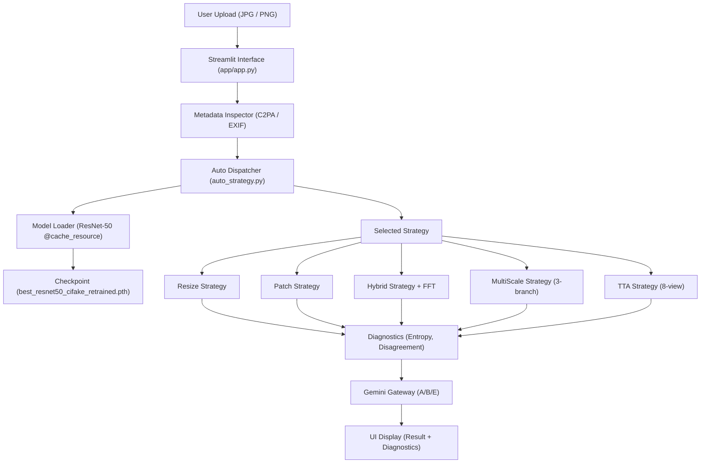
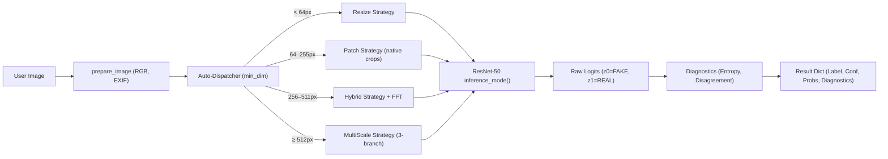
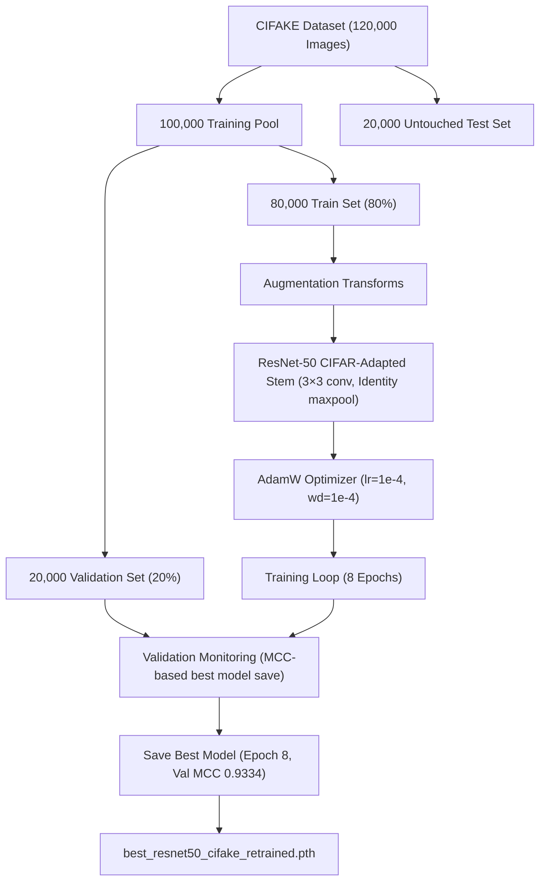
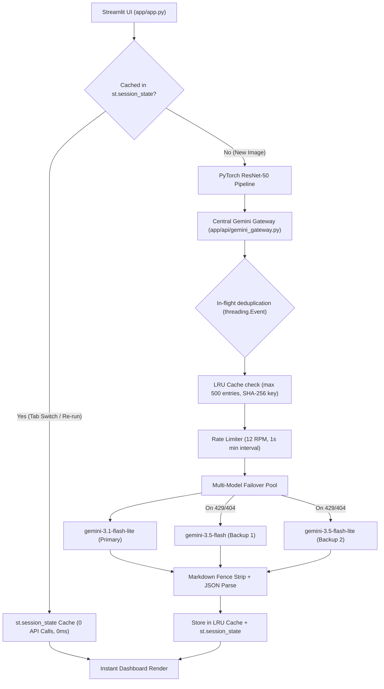

# 02. System Architecture — SignalScope

## 1. System Overview & Component Responsibilities

SignalScope is organized into decoupled Python modules:

- **`app/config.py`**: Central configuration storing model path (`model/best_resnet50_cifake_retrained.pth`), ImageNet normalization mean/std, spatial input dimensions (`32, 32`), class mapping (`0: FAKE`, `1: REAL`), strategy thresholds (`MULTISCALE_FAKE_THRESHOLD=0.608`, `MULTISCALE_REAL_THRESHOLD=0.40`, `MULTISCALE_TOP_K_RATIO=0.20`), and benchmark metrics constants.
- **`app/model_loader.py`**: Handles device selection (`cuda` vs `cpu`), instantiates `torchvision.models.resnet50(weights=None)`, auto-detects the checkpoint stem variant (standard 7×7 ImageNet stem vs CIFAR-adapted 3×3 stem), replacing the final layer with `Linear(2048, 2)`, restores weight tensors, and caches the model using Streamlit's `@st.cache_resource`. Uses `weights_only=True` with a comprehensive numpy dtype allowlist for checkpoint security.
- **`app/predictor.py`**: Facade module that re-exports all inference functions from the strategy packages for backward compatibility. Delegates directly to `auto_strategy.predict_image_auto`.
- **`app/strategies/`**: Contains six modular inference strategies: Auto-Dispatcher, Baseline Resize, Native Patch Voting, Hybrid Consensus, 3-Branch MultiScale, and 8-View TTA.
- **`app/api/gemini_gateway.py`**: Centralized, resilient gateway for Google GenAI SDK calls. Implements `gemini-3.1-flash-lite` (primary), automated multi-model failover, zero-thinking latency optimization (`thinking_budget=0`), thread-safe LRU in-memory response cache (500-entry max, OrderedDict-based eviction), rate limiting (12 req/min, 1s spacing), request coalescing (in-flight deduplication via `threading.Event`), bounded 429 retries, and regex markdown fence stripping.
- **`app/api/prompt_registry.py`**: Versioned prompt definitions for Generator Attribution (Module B — neutral framing with 30+ generator families), Faithful Explanation (Module A — richer diagnostic context, 300 token budget), and Multimodal Consistency (Module E).
- **`app/diagnostics/`**: Contains analytics modules:
  - `entropy.py` — Shannon entropy + confidence label bands
  - `disagreement.py` — patch-level statistical disagreement metrics
  - `fft_spectral.py` — 2D FFT radial spectral anomaly scoring (used exclusively by hybrid strategy)
  - `explainer.py` — Gemini faithful explanation caller (Module A)
  - `metadata_inspector.py` — C2PA/EXIF/PNG AI provenance inspector with 44 known AI signatures (Module D)
  - `multimodal_consistency.py` — Image-caption consistency scorer (Module E)
- **`model/`**: Contains the frozen weights (`best_resnet50_cifake_retrained.pth`) and `generator_attribution.py` (Module B Gemini fallback — uses `app.api` imports).
- **`app/app.py`**: Streamlit web dashboard managing UI rendering, single/batch upload tabs, `st.session_state` inference/API caching, on-demand retry buttons, live diagnostic logits expanders, and CSV downloads.

---

## 2. Training-Time vs. Inference-Time Architecture

| Feature | Training Pipeline (`notebook/`) | Local Inference App (`app/`) |
| :--- | :--- | :--- |
| **Execution Host** | Google Colab (Tesla T4 GPU) | Local Workstation (CPU / CUDA) |
| **Model Mode** | `model.train()` (Backpropagation) | `model.eval()` (`torch.inference_mode()`) |
| **Transformations** | Random Horizontal Flip, Rotation, ColorJitter | Strategy-dependent (resize, native 32×32 crop, or TTA augmentations) |
| **Weight Modification**| Weights updated via AdamW (1×10⁻⁴) | Read-only frozen checkpoint weights |

---

## 3. CPU / CUDA Execution & Error Handling

- **Device Auto-Detection**: `get_device()` checks `torch.cuda.is_available()`. Loads weights using `map_location=device` to ensure seamless CPU execution when GPU acceleration is unavailable.
- **Error Shielding**: `model_loader.py` catches `FileNotFoundError` if the checkpoint is missing, and `app.py` catches PIL decode errors to display friendly user alerts without exposing raw tracebacks.
- **Security**: Checkpoint loading uses `weights_only=True` with a comprehensive numpy dtype allowlist (`numpy.dtype`, `numpy._core.multiarray.scalar`, and all `numpy.dtypes.*` concrete types).

---

## 4. Architectural Mermaid Diagrams

### Diagram 1: Full System Data Flow

### Diagram 2: Auto-Dispatcher Routing (4-Tier)

### Diagram 3: Training Pipeline

### Diagram 4: Gemini Gateway Architecture

