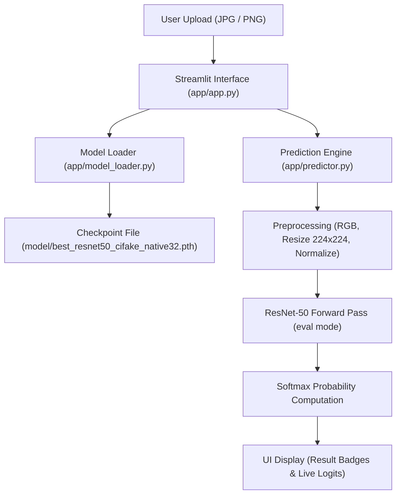
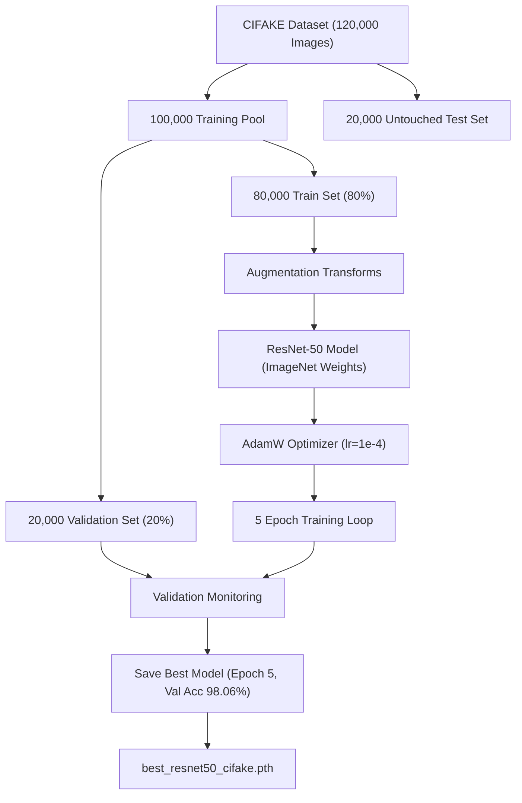

# 02. System Architecture — SignalScope

## 1. System Overview & Component Responsibilities

SignalScope is organized into decoupled Python modules:

- **`app/config.py`**: Central configuration storing model path (`model/best_resnet50_cifake_native32.pth`), ImageNet normalization mean/std, spatial input dimensions (`224, 224`), class mapping (`0: FAKE`, `1: REAL`), and benchmark metrics constants.
- **`app/model_loader.py`**: Handles device selection (`cuda` vs `cpu`), instantiates `torchvision.models.resnet50(weights=None)`, replaces the final layer with `Linear(2048, 2)`, restores weight tensors, and caches the model using Streamlit's `@st.cache_resource`.
- **`app/predictor.py`**: Handles image preprocessing (EXIF correction, RGB conversion, $224 \times 224$ resize, ImageNet normalization), runs inference inside `torch.no_grad()`, computes Softmax probabilities, and processes single & batch predictions.
- **`app/app.py`**: Streamlit web dashboard managing UI rendering, single/batch upload tabs, live diagnostic logits expanders, and CSV downloads.

---

## 2. Training-Time vs. Inference-Time Architecture

| Feature | Training Pipeline (`notebook/`) | Local Inference App (`app/`) |
| :--- | :--- | :--- |
| **Execution Host** | Google Colab (Tesla T4 GPU) | Local Workstation (CPU / CUDA) |
| **Model Mode** | `model.train()` (Backpropagation) | `model.eval()` (`torch.no_grad()`) |
| **Transformations** | Random Horizontal Flip, Rotation, ColorJitter | Deterministic Resize $224 \times 224$ & Normalization |
| **Weight Modification**| Weights updated via AdamW ($1 \times 10^{-4}$) | Read-only frozen checkpoint weights |

---

## 3. CPU / CUDA Execution & Error Handling

- **Device Auto-Detection**: `get_device()` checks `torch.cuda.is_available()`. Loads weights using `map_location=device` to ensure seamless CPU execution when GPU acceleration is unavailable.
- **Error Shielding**: `model_loader.py` catches `FileNotFoundError` if the checkpoint is missing, and `app.py` catches PIL decode errors to display friendly user alerts without exposing raw tracebacks.

---

## 4. Architectural Mermaid Diagrams

### Diagram 1: System Architecture

### Diagram 2: Training Pipeline

### Diagram 3: Inference Pipeline

```mermaid
graph LR
    PIL["PIL Image"] --> RGB["RGB & EXIF Correction"]
    RGB --> Resize["Resize (224, 224)"]
    Resize --> Tensor["ToTensor (0 to 1)"]
    Tensor --> Normalize["ImageNet Normalize"]
    Normalize --> BatchDim["Unsqueeze Batch (1, 3, 224, 224)"]
    BatchDim --> Device["Device Shift (CPU/CUDA)"]
    Device --> EvalPass["ResNet-50 eval() (torch.no_grad)"]
    EvalPass --> Logits["Raw Logits (z0, z1)"]
    Logits --> Softmax["Softmax Activation"]
    Softmax --> DictOut["Result Dict (Label, Conf, Probs)"]
```

